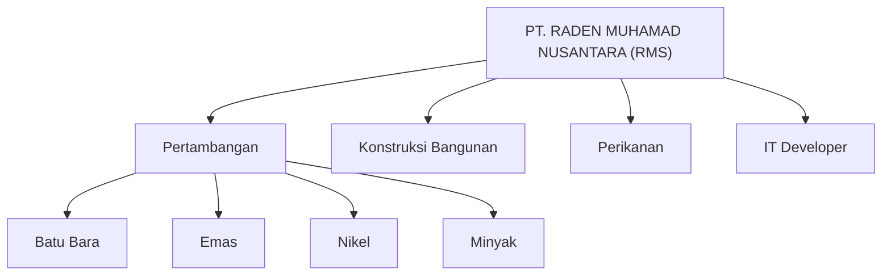

# RMS
**RMS – PT. RADEN MUHAMAD NUSANTARA Management System**  
Pioneering Excellence in Gold Mining & Solar Energy Solution


---

## 📖 Description
RMS is a management system developed by **PT. RADEN MUHAMAD NUSANTARA** to support operations in **Gold Mining** and **Solar Energy Solutions**.  
It is designed to improve operational efficiency, project planning, and resource management with a modern, scalable approach.

### 🏢 Subsidiaries & Business Units


### 🚀 Features

Project planning for Gold Mining and Solar Energy.

Resource and asset management.

Reporting dashboard for management insights.

Secure and user-friendly interface.

```bash
# Clone the repository
git clone https://github.com/kongali1720/RMS.git

# Navigate into project directory
cd RMS

# Install dependencies (if any)
# Example: npm install or pip install -r requirements.txt
```


